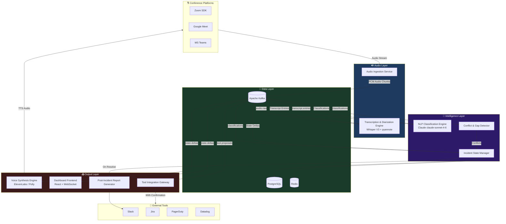
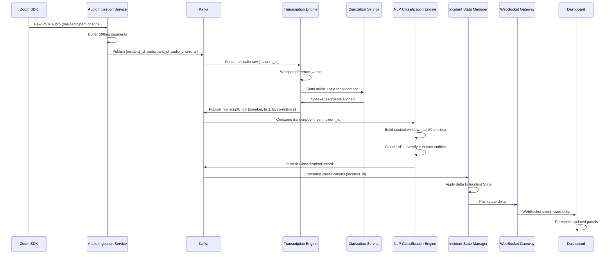
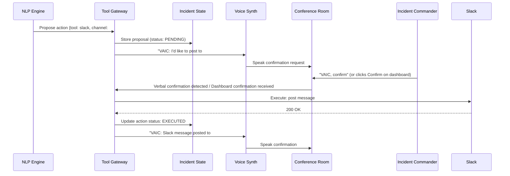
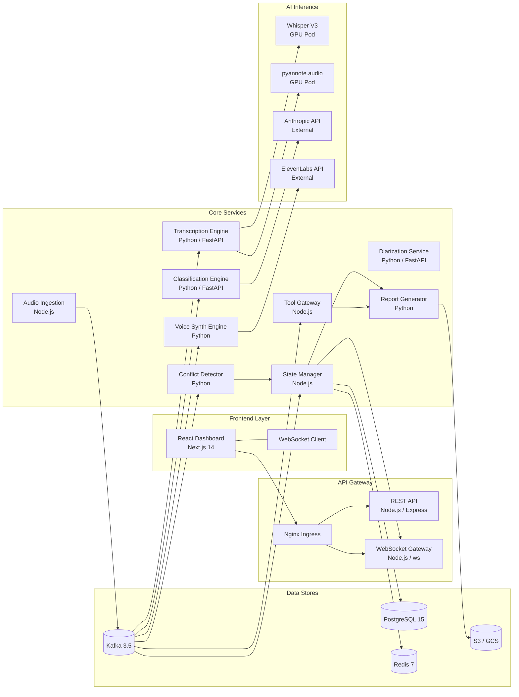
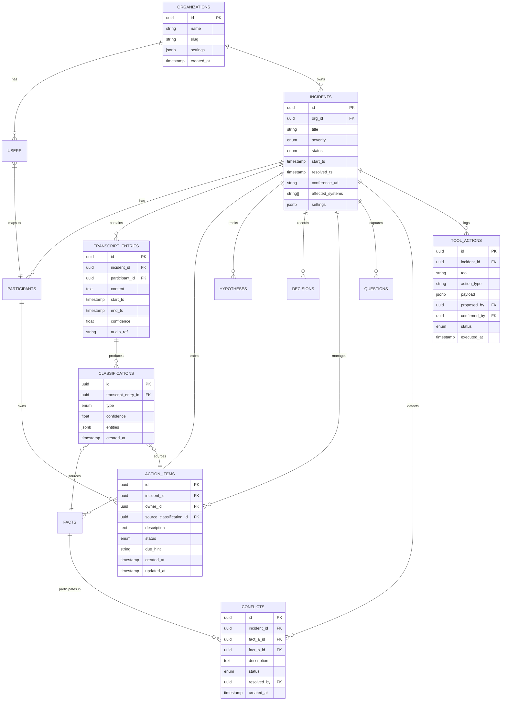
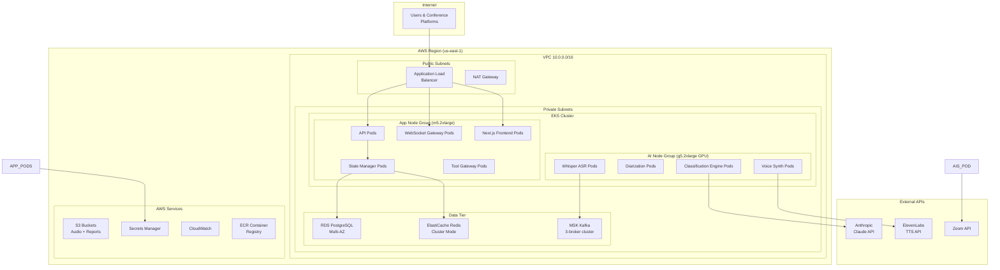
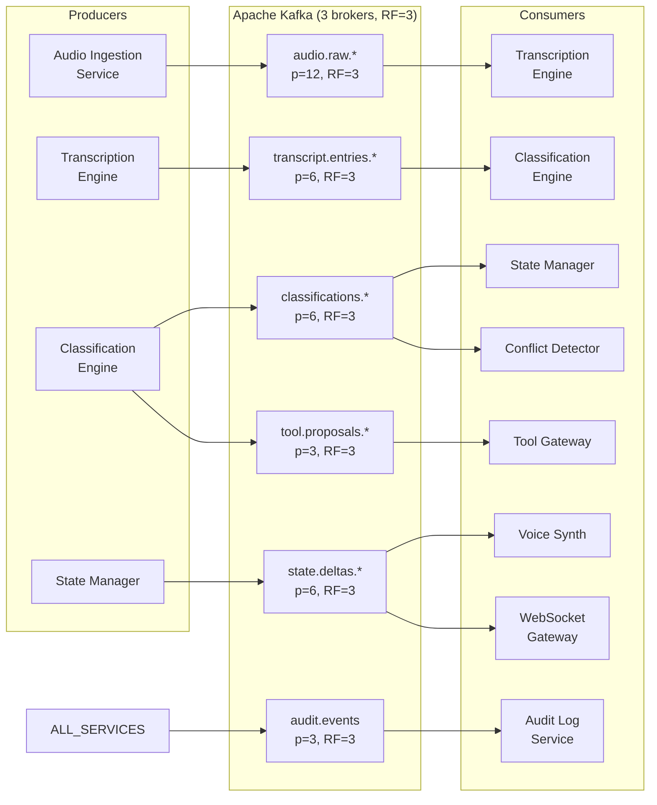
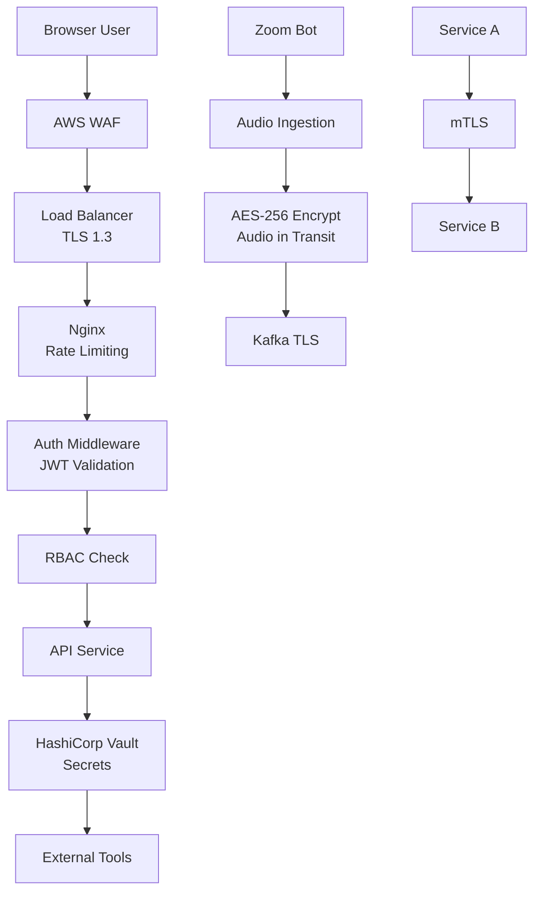

# System Design Document
## Voice AI Incident Commander (VAIC)

**Version:** 1.0.0
**Date:** August 2026

---

## 1. High-Level Architecture

VAIC follows a **event-driven microservices architecture** with a streaming data pipeline at its core. Audio flows from conference platforms through a multi-stage processing pipeline — transcription → diarization → LLM classification → state management — while a separate WebSocket gateway broadcasts real-time updates to the dashboard, and a voice synthesis engine returns spoken output to the conference room.



---

## 2. Low-Level Architecture

### 2.1 Audio Processing Pipeline



### 2.2 Confirmation Gate Flow



---

## 3. Component Diagram



---

## 4. Data Flow

```mermaid
flowchart TD
    AUDIO([🎙️ Audio Stream]) --> CHUNKS[500ms Audio Chunks]
    CHUNKS --> TRANSCRIPT[Transcript Entry\n{speaker, text, ts, confidence}]
    TRANSCRIPT --> CLASS[Classification Record\n{type, entities, confidence}]

    CLASS --> FACT{Type?}
    FACT -->|FACT| FACTS_REG[Facts Registry]
    FACT -->|HYPOTHESIS| HYP_REG[Hypotheses Registry]
    FACT -->|DECISION| DEC_REG[Decisions Registry]
    FACT -->|ACTION_ITEM| AI_REG[Action Items Registry]
    FACT -->|QUESTION| Q_REG[Questions Registry]
    FACT -->|STATUS_UPDATE| TIMELINE[Incident Timeline]

    FACTS_REG --> CONFLICT{Conflicts with\nexisting fact?}
    CONFLICT -->|Yes| CONFLICT_REG[Conflicts Registry]
    CONFLICT -->|No| STATE[Incident State Object]

    AI_REG --> OWNER{Owner\nassigned?}
    OWNER -->|No| UNASSIGNED[Unassigned AIs]
    OWNER -->|Yes| STATE

    Q_REG --> ANSWERED{Answered\nwithin 5min?}
    ANSWERED -->|No| UNRESOLVED_Q[Unresolved Questions]
    ANSWERED -->|Yes| STATE

    STATE --> DELTA[State Delta]
    DELTA --> WS[WebSocket Broadcast]
    DELTA --> VOICE[Voice Summary\n@ interval or command]
    DELTA --> TOOLS{Tool Action\nDetected?}
    TOOLS -->|Yes| CONFIRM[Confirmation Gate]
    CONFIRM -->|Approved| EXECUTE[Execute Integration]
    CONFIRM -->|Rejected| LOG[Audit Log]
```

---

## 5. Module Breakdown

| Module | Language | Framework | Responsibility |
|---|---|---|---|
| Audio Ingestion Service | Node.js | Express + Zoom Video SDK | Conference bot; audio stream capture |
| Transcription Engine | Python | FastAPI | Whisper V3 inference; utterance detection |
| Diarization Service | Python | FastAPI | pyannote speaker segmentation + identity mapping |
| NLP Classification Engine | Python | FastAPI | Claude API calls; entity extraction; JSON parsing |
| Conflict & Gap Detector | Python | FastAPI | Rule + LLM-based conflict detection |
| Incident State Manager | Node.js | Express | State CRUD; Kafka consumer; WebSocket emit |
| Voice Synthesis Engine | Python | FastAPI | TTS generation; command detection; audio injection |
| Tool Integration Gateway | Node.js | Express | Slack/Jira/PagerDuty integration; confirmation gate |
| Post-Incident Report Generator | Python | FastAPI | LLM-based report generation; PDF/Markdown export |
| Dashboard Frontend | TypeScript | Next.js 14 + React | Real-time incident dashboard |
| WebSocket Gateway | Node.js | ws library | Client connection management; event fan-out |
| REST API | Node.js | Express | External-facing HTTP API |
| API Gateway | Infrastructure | Nginx | TLS termination; routing; rate limiting |

---

## 6. Database Design

### 6.1 Entity-Relationship Diagram



---

## 7. AI Pipeline

```mermaid
flowchart LR
    subgraph ASR["ASR Pipeline"]
        AUDIO[Audio Chunk\n500ms PCM] --> VAD[Voice Activity\nDetection]
        VAD -->|Speech detected| WHISPER[Whisper Large V3\nGPU Inference]
        WHISPER --> TEXT[Raw Transcript Text]
    end

    subgraph DIAR["Diarization Pipeline"]
        AUDIO2[Audio Chunk] --> PYANNOTE[pyannote.audio\nspeaker-diarization-3.1]
        PYANNOTE --> SEGMENTS[Speaker Segments\n{speaker_label, start, end}]
        SEGMENTS --> ALIGN[Align with\nTranscript Text]
        TEXT --> ALIGN
        ALIGN --> ATTRIBUTED[Attributed Utterance\n{speaker, text, ts}]
    end

    subgraph LLM["LLM Classification Pipeline"]
        ATTRIBUTED --> CONTEXT[Build Context Window\nLast 50 utterances]
        CONTEXT --> PROMPT[Construct Classification Prompt]
        PROMPT --> CLAUDE[Claude claude-sonnet-4-6\nAnthropic API]
        CLAUDE --> JSON_RESP[JSON Response\n{type, entities, confidence}]
        JSON_RESP --> VALIDATE[Schema Validation\nPydantic]
        VALIDATE --> RECORD[Classification Record]
    end

    subgraph CONFLICT["Conflict Detection"]
        RECORD --> EMBED[Semantic Embedding\ntext-embedding-3-small]
        EMBED --> SEARCH[Vector Similarity Search\nvs existing facts]
        SEARCH --> THRESHOLD{Similarity > 0.85\nAND Contradicts?}
        THRESHOLD -->|Yes| CONFLICT_LLM[Claude: Confirm Contradiction]
        CONFLICT_LLM --> CONFLICT_RECORD[Conflict Record]
    end
```

### 7.1 Classification Prompt Design

```
System: You are an incident intelligence extraction engine. 
Classify each utterance from an ongoing technical incident response call.

For each utterance, return ONLY valid JSON matching this schema:
{
  "type": "FACT | HYPOTHESIS | DECISION | ACTION_ITEM | QUESTION | STATUS_UPDATE | SOCIAL",
  "confidence": 0.0-1.0,
  "summary": "concise restatement",
  "entities": {
    "systems": [],
    "people": [],
    "timestamps": [],
    "metrics": [],
    "error_codes": []
  },
  "action_item_owner": "name or null",
  "requires_followup": true|false
}

Context (last 10 entries):
[CONTEXT WINDOW]

Current utterance:
Speaker: {speaker_name} ({role})
Text: "{utterance_text}"
```

---

## 8. Cloud Architecture



---

## 9. Caching Strategy

| Data | Cache Location | TTL | Invalidation |
|---|---|---|---|
| Current Incident State | Redis (Hash) | Incident duration | On every state delta |
| LLM Context Window (last 50 utterances) | Redis (List) | Incident duration | Rolling append |
| User roles & permissions | Redis (Hash) | 5 minutes | On role change |
| Integration auth tokens | Redis (String) | Token expiry - 60s | On token refresh |
| TTS audio clips (repeated phrases) | Redis (String) | 1 hour | On content change |
| Dashboard session | Redis (Hash) | 24 hours | On logout |

---

## 10. Queue Architecture



---

## 11. Security Architecture



---

## 12. CI/CD Pipeline

```mermaid
graph LR
    PR[Developer\nPull Request] --> GH[GitHub Actions\nTrigger]
    GH --> LINT[Lint &\nType Check]
    LINT --> UNIT[Unit Tests\n≥80% coverage]
    UNIT --> BUILD[Docker\nBuild]
    BUILD --> SCAN[Snyk Security\nScan]
    SCAN --> PUSH[Push to ECR]
    PUSH --> STAGING[Deploy to\nStaging]
    STAGING --> E2E[Playwright\nE2E Tests]
    E2E --> LOAD[k6 Load\nTest - Smoke]
    LOAD --> APPROVAL{Manual\nApproval}
    APPROVAL -->|Approved| PROD[Deploy to\nProduction]
    PROD --> CANARY[5% Canary\nDeploy]
    CANARY --> MONITOR[Monitor Error\nRate 15min]
    MONITOR -->|Healthy| FULL[100% Rollout]
    MONITOR -->|Unhealthy| ROLLBACK[Auto Rollback]
```



---

## 13. Folder Structure

```
voice-ai-incident-commander/
├── services/
│   ├── audio-ingestion/              # Node.js - Zoom SDK bot
│   │   ├── src/
│   │   │   ├── bot/                  # Conference platform bots
│   │   │   ├── audio/                # Audio buffer & streaming
│   │   │   ├── kafka/                # Kafka producer
│   │   │   └── index.ts
│   │   ├── Dockerfile
│   │   └── package.json
│   │
│   ├── transcription-engine/         # Python - Whisper + Diarization
│   │   ├── src/
│   │   │   ├── asr/                  # Whisper inference
│   │   │   ├── diarization/          # pyannote pipeline
│   │   │   ├── alignment/            # Speaker-text alignment
│   │   │   ├── kafka/                # Consumer + producer
│   │   │   └── main.py
│   │   ├── Dockerfile.gpu
│   │   └── requirements.txt
│   │
│   ├── classification-engine/        # Python - Claude API
│   │   ├── src/
│   │   │   ├── prompts/              # Prompt templates
│   │   │   ├── classifiers/          # Type classifiers
│   │   │   ├── extractors/           # Entity extractors
│   │   │   ├── context/              # Context window manager
│   │   │   ├── kafka/                # Consumer + producer
│   │   │   └── main.py
│   │   ├── Dockerfile
│   │   └── requirements.txt
│   │
│   ├── conflict-detector/            # Python - Conflict detection
│   │   ├── src/
│   │   │   ├── embeddings/           # Semantic similarity
│   │   │   ├── rules/                # Rule-based conflict detection
│   │   │   ├── llm/                  # LLM confirmation
│   │   │   └── main.py
│   │   └── requirements.txt
│   │
│   ├── incident-state-manager/       # Node.js - State management
│   │   ├── src/
│   │   │   ├── state/                # State model & mutations
│   │   │   ├── kafka/                # Consumer
│   │   │   ├── websocket/            # WebSocket emit
│   │   │   ├── db/                   # PostgreSQL + Redis
│   │   │   └── index.ts
│   │   └── package.json
│   │
│   ├── voice-synthesis-engine/       # Python - TTS + Command Detection
│   │   ├── src/
│   │   │   ├── commands/             # Voice command recognition
│   │   │   ├── summaries/            # Summary generation
│   │   │   ├── tts/                  # ElevenLabs / Polly integration
│   │   │   ├── scheduler/            # Interval-based summaries
│   │   │   └── main.py
│   │   └── requirements.txt
│   │
│   ├── tool-integration-gateway/     # Node.js - External tools
│   │   ├── src/
│   │   │   ├── confirmation/         # Confirmation gate logic
│   │   │   ├── integrations/
│   │   │   │   ├── slack/
│   │   │   │   ├── jira/
│   │   │   │   ├── pagerduty/
│   │   │   │   └── datadog/
│   │   │   ├── kafka/
│   │   │   └── index.ts
│   │   └── package.json
│   │
│   ├── report-generator/             # Python - ISR generation
│   │   ├── src/
│   │   │   ├── templates/            # Report templates
│   │   │   ├── generators/           # PDF, Markdown, Confluence
│   │   │   ├── llm/                  # Claude for executive summary
│   │   │   └── main.py
│   │   └── requirements.txt
│   │
│   └── api/                          # Node.js - REST API
│       ├── src/
│       │   ├── routes/               # Endpoint handlers
│       │   ├── middleware/           # Auth, RBAC, validation
│       │   ├── db/                   # Database access layer
│       │   └── index.ts
│       └── package.json
│
├── frontend/                         # Next.js 14 Dashboard
│   ├── src/
│   │   ├── app/                      # Next.js app router
│   │   ├── components/
│   │   │   ├── timeline/
│   │   │   ├── facts-panel/
│   │   │   ├── action-items/
│   │   │   ├── conflicts/
│   │   │   ├── participants/
│   │   │   └── confirmation-modal/
│   │   ├── hooks/                    # useWebSocket, useIncidentState
│   │   ├── stores/                   # Zustand state stores
│   │   └── lib/                      # API clients
│   └── package.json
│
├── infrastructure/
│   ├── terraform/
│   │   ├── modules/
│   │   │   ├── eks/
│   │   │   ├── rds/
│   │   │   ├── kafka/
│   │   │   └── redis/
│   │   └── environments/
│   │       ├── staging/
│   │       └── production/
│   ├── helm/
│   │   └── vaic/                     # Umbrella Helm chart
│   │       ├── Chart.yaml
│   │       ├── values.yaml
│   │       └── templates/
│   └── k8s/
│       └── monitoring/               # Prometheus, Grafana, Loki configs
│
├── shared/
│   ├── schemas/                      # Shared data schemas (TypeScript + Python)
│   ├── kafka-types/                  # Kafka message type definitions
│   └── constants/                    # Shared constants
│
├── tests/
│   ├── unit/
│   ├── integration/
│   ├── e2e/
│   └── audio-fixtures/               # Sample audio for ASR testing
│
├── docs/
│   ├── api/                          # OpenAPI spec
│   ├── runbooks/
│   └── adr/                          # Architecture Decision Records
│
├── .github/
│   └── workflows/
│       ├── ci.yml
│       ├── deploy-staging.yml
│       └── deploy-production.yml
│
├── docker-compose.yml                # Local development
└── Makefile                          # Common commands
```

---

## 14. Technology Stack

| Category | Technology | Rationale |
|---|---|---|
| **ASR** | OpenAI Whisper Large V3 (self-hosted) | State-of-the-art WER; runs on-premises for data residency |
| **Diarization** | pyannote.audio 3.1 | Industry-leading speaker diarization accuracy |
| **LLM** | Anthropic Claude claude-sonnet-4-6 | Best-in-class instruction following for structured JSON classification |
| **TTS** | ElevenLabs (primary) / AWS Polly (fallback) | Natural voice quality; low latency |
| **Audio Streaming** | Zoom Video SDK | Most widely adopted enterprise conference platform |
| **Message Queue** | Apache Kafka (MSK) | High-throughput, ordered event streaming; replay capability |
| **Primary Database** | PostgreSQL 15 (RDS) | ACID compliance; rich JSON support for entity storage |
| **Cache** | Redis 7 (ElastiCache) | Sub-millisecond incident state reads; Pub/Sub for WS delivery |
| **Frontend** | Next.js 14 + React 18 | App router; server components; excellent real-time WebSocket support |
| **State Management** | Zustand | Lightweight, performant React state |
| **Backend Services** | Node.js (TypeScript) | Non-blocking I/O for audio/WebSocket handling |
| **AI Services** | Python (FastAPI) | ML ecosystem compatibility; async performance |
| **Container Orchestration** | Kubernetes (EKS) | Production-grade; horizontal auto-scaling |
| **Service Mesh** | Istio | mTLS; observability; traffic management |
| **IaC** | Terraform | Cloud-agnostic; mature state management |
| **CI/CD** | GitHub Actions | Native GitHub integration; rich marketplace |
| **Monitoring** | Prometheus + Grafana | Open standard; powerful alerting |
| **Logging** | Loki + Grafana | Cost-effective; label-based querying |
| **Tracing** | Jaeger / OpenTelemetry | Distributed trace correlation across services |
| **Secrets** | HashiCorp Vault | Dynamic secrets; automatic rotation |

---

## 15. Design Patterns

| Pattern | Applied Where | Why |
|---|---|---|
| **Event Sourcing** | Incident State Manager | Immutable audit log; full state reconstruction |
| **CQRS** | State Manager API | Separate read (dashboard) and write (classification) paths |
| **Saga Pattern** | Tool Integration Gateway | Multi-step confirmation + execution with compensation |
| **Circuit Breaker** | All external API calls | Prevent cascade failures during tool outages |
| **Strangler Fig** | Tool integrations (adding new tools) | Add integrations without changing core pipeline |
| **Publisher-Subscriber** | Kafka topics | Decoupled service communication |
| **Repository Pattern** | Database access | Testable, swappable data layer |
| **Strategy Pattern** | TTS provider selection | Switch ElevenLabs ↔ Polly without code changes |
| **Chain of Responsibility** | Classification pipeline | Each stage processes then passes; easy to extend |

---

## 16. Scalability Strategy

- **Audio Ingestion:** Scale horizontally — 1 pod per active incident (isolated Kafka partition)
- **Whisper Inference:** GPU nodes auto-scale based on `audio.raw` topic lag
- **Classification Engine:** Scale based on `transcript.entries` topic consumer lag
- **State Manager:** Scale read replicas; single writer per incident (Kafka consumer group)
- **WebSocket Gateway:** Consistent hashing — all connections for an incident routed to same pod set
- **Database:** Read replicas for dashboard queries; connection pooling via PgBouncer

---

## 17. Fault Tolerance & Disaster Recovery

| Failure Scenario | Detection | Recovery |
|---|---|---|
| ASR pod crash | Kubernetes liveness probe | Pod auto-restart; Kafka offset maintained; no utterance loss |
| Claude API outage | Circuit breaker | Queue utterances; display "AI processing paused" on dashboard |
| Kafka broker failure | Kafka replication | Consumer continues from replica; RF=3 tolerates 2 broker failures |
| PostgreSQL primary failure | RDS Multi-AZ failover | Automatic failover <60s; application auto-reconnects |
| Redis failure | ElastiCache cluster mode | Failover to replica shard; state cache rebuilt from PostgreSQL |
| Zoom bot disconnect | SDK reconnect logic | Auto-rejoin within 10s; audio gap logged but processing continues |
| Full region failure | Multi-region standby (future) | Manual failover to DR region; RTO 15min |
